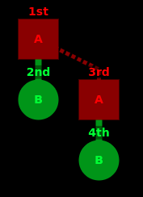

# DAG Visualizer

For visualizing DAGs in browser canvas.

## Usage

Clone the repo and build it:
```
npm install
npm run build
``` 

## Tutorial

DAGs are defined using
- **Nodes** (the vertices) which have a _type_ and a _name_
- **Links** (the edges) between nodes which are either primary or secondary (rendered differently)
- **Groups** which contain subset of graph nodes that are logically related (for rendering them with matching colors etc)

Here's [an example](examples/tutorial.html) showing all the features:

```javascript
    // initialize Visualizer with the id of the canvas- HTML element 
    let graph = new Visualizer('myCanvas')

    // nodes are organized in a group for collective rendering
    let group = graph.group()
    let otherGroup = graph.group()
    
    // renderer can choose a different rendering based on node-data, and each group can
    // have separate renderers 
    let renderer = (node) => {
        switch (node.type) {
            case 'A':
                return { bg: '#880000', fg: '#ff0000', shape: 'square' }
            case 'B':
                return { bg: '#008800', fg: '#00ff00', shape: 'circle' }
        }
    }
    group.render(renderer)
    otherGroup.render(renderer)

    // nodes are created via a group, by passing a type and a name, and an optional 
    // primary link
    let first = group.node('A', '1st')
    let second = group.node('B', '2nd', first)
    let third = otherGroup.node('A', '3rd')
    let fourth = otherGroup.node('B', '4th', third)

    // secondary links are added separately
    third.link(first)

    // finally render the DAG onto canvas '#myCanvas'
    graph.render()
```

Here's how it will look like in browser:
 
   

## Examples

- [`examples/example1.html`](examples/tutorial.html) - the tutorial example 
- [`examples/ambients.html`](examples/ambients.html) - (unfinished) draft of the [Ambients protocol](https://ambients.org) execution DAG 

## Dependencies

DAG Visualizer builds on great work of others:

- [Paper.js](https://github.com/paperjs/paper.js) - which does the drawing
- [Dagre.js](https://github.com/dagrejs/dagre) - which does the DAG layout

## Todo

- CSS-based styling
- More control over rendering
- Interactions with the graph
- Pluggable layout algorithms

## License

[MIT](LICENSE)


